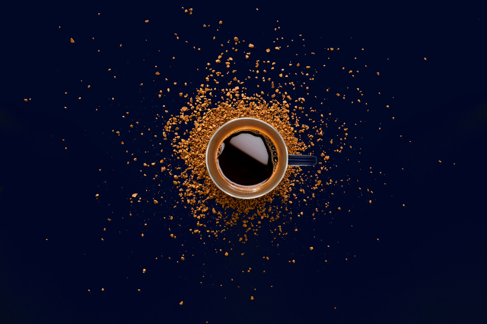

The following examples showcase the Starlight Image Zoom plugin in action.

## Markdown

```md
---
// src/content/docs/example.md
title: My page title
---


```

The code above generates the following image on the page.



import ImageAttribution from '../../components/ImageAttribution.astro'

<ImageAttribution id="ceramic-mug-on-table-OmOvMdiaZZ0" name="Robert Shunev" username="rshunev" />

## `<Image />`

```mdx
---
// src/content/docs/example.mdx
title: My page title
---

import { Image } from 'astro:assets'
import paper from '../../assets/paper.jpg'

<Image src={paper} alt="Brown pencil on white printing paper" />
```

import { Image } from 'astro:assets'
import paper from '../../assets/demo/paper.jpg'

<Image src={paper} alt="Brown pencil on white printing paper" />

<ImageAttribution id="brown-pencil-on-white-printing-paper-fteR0e2BzKo" name="Sven Mieke" username="sxoxm" />

## `<Picture />`

```mdx
---
// src/content/docs/example.mdx
title: My page title
---

import { Picture } from 'astro:assets'
import blackboard from '../../assets/blackboard.jpg'

<Picture src={blackboard} formats={['avif', 'webp']} alt="A blackboard with a bunch of diagrams on it" />
```

import { Picture } from 'astro:assets'
import blackboard from '../../assets/demo/blackboard.jpg'

<Picture src={blackboard} formats={['avif', 'webp']} alt="A blackboard with a bunch of diagrams on it" />

<ImageAttribution
  id="a-blackboard-with-a-bunch-of-diagrams-on-it-h3kuhYUCE9A"
  name="Dan Cristian Pădureț"
  username="dancristianpaduret"
/>
